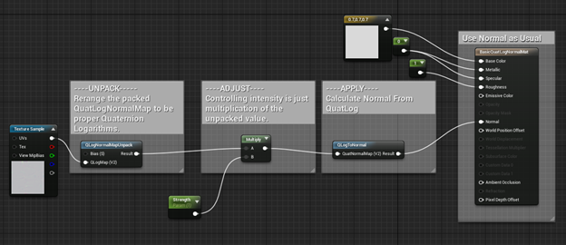

# Using QLog Maps

## What are QLog Maps?
QLog maps represent normal direction changes as quaternion logarithms (axis*angle rotations).

## Why use QLog Maps?
Using a QLog map directly (i.e. a single map, at 100%) involves a little more cost than a normal map, so you’d likely not want to use them for that case. (Potential reasons you may wish to for that are that QLog maps compress to less than half the size of normal maps, you could also look at reducing bit precision with QLog maps to save further space in various ways, but it’s generally more realistic to stick with normal maps for the usual use case). QLog maps can be mixed with normal maps, so you can select which you want to use on a case by case basis within your project.

The big advantage with QLog maps is they behave correctly and cheaply through other operations (such as blending – a LERP moves the normal in a SLERPing arc), and can extremely cheaply provide detail maps (you can just add them).

## Converting Normal Maps To QLog Maps
Ideally, source normal maps should be 16 bit or higher, especially if you’re using the bias argument for your QLog maps in order to focus bit precision. Though if you only have 8 bit normal maps, those can be converted, though you may see some very minor differences (though these are unlikely to be perceptible). 

With the provided command line tools you can convert your normal maps, either using the Z channel from the image, or inferring it from X and Y channels.

The basic form is:

```bat
convertNormalToQLog [inputImage.ext] [outputImage.ext]
```

If you don’t have a Z channel in your normal map (or for some other reason wish to calculate Z from X and Y), add the --deriveZ flag.

```bat
convertNormalToQLog --deriveZ [inputImage.ext] [outputImage.ext]
```

Conversion from QLog to normal can be done with the inverse flag, -i.

As this tool uses OpenImageIO, it can handle any format supported by OpenImageIO.

> Note: QLog maps are pure two dimensional representations of normal adjustments, i.e. unlike regular normal maps there is no third channel, derived or otherwise. So, when packaging for use in a game you don’t need that data or to reconstruct it. In conversion, it’s always written at a value of 0.5. (This is because you could view the three channels as the imaginary components of a quaternion logarithm, in what case Z would be 0, which after packing in range is 0.5. Plus is makes them prettier and more intuitive to work with in painting applications)

## Using QLog Maps in your shaders
Using QLog maps has three phases; unpacking, adjusting, and applying. Here’s an example graph from Unreal Engine, which illustrates the overall flow.



### Unpacking
The unpacking step is to take the QLog map from the 0-1 range of an image, to the -π/4 to π/4 range of the quaternion hemisphere it encodes. Just multiply by half π, then subtract π/4 and you’re done with the unpacking section. 

For quick reference:  
π/2 = 1.5707963267948966192  
π/4 = 0.78539816339744830962

### Adjusting
This phase could be skipped, but as mentioned earlier, there are only limited benefits to justify the added cost.

You can weight the strength of an unpacked QLog by simply multiplying it. This works for both reduction and increase in the normal perturbation. This also maintains the angular relationship of one pixel to another. If a given pixel had half the angular rotation of another, after multiplication by the same factor, it will still have half the rotation. One use case (beyond just increasing/decreasing the entire map) for this could be taking vertex compression to drive a weight to multiply a QLog wrinkle map with.

To blend between QLog maps just lerp between them. 

```hlsl 
float2 Qlog = lerp(QLogA, QLogB, alpha); 
```

Detail normal maps are achieved by just adding unpacked QLogs together. Though, you’d likely want to have some form of strength control before hand in most cases, but any of these operations can be combined as you wish. The results for combining through addition are very close to correctly layering the operations (which can also be done, but is much, much more mathematically complex, so I haven’t put the details in here).

### Applying
The last step of applying a QLog map just converts it from a quaternion logarithm to a basis vector. This result is the same as an unpacked normal map (i.e. multiply by 2, then subtract one). So, the result of this is used in the same place you’d use an unpacked normal map value.

The code below provides an example implementation in HLSL.

```hlsl
float u = QuaternionLogarithm[0];
float v = QuaternionLogarithm[1];
float halfAngle = sqrt(u*u+v*v);
float angle = 2 * halfAngle;
if (halfAngle < 0.0001)
{
   halfAngle = 1;
}
float sinAngle = sin(angle);

float3 result;

result[0] = (u * sinAngle) / halfAngle;
result[1] = (v * sinAngle) / halfAngle;
result[2] = cos(angle);

return result;
```

## Advanced QLog Map Usage
The above covered what’s likely to be the use cases most of the time, but there’s also the option of bias available in here, which can be used to distribute the bit precision in the packed QLog map. Positive values shift the bit precision toward the normal (if you’re using it at all, this is likely what you want). Negative values shift it away from the normal (toward the horizon).

### Conversion
To use bias during the conversion, just add the --bias ${biasValue} flag, which provides the bias value. The bias value is floating point, so you’re not limited to integers.

```bat
convertNormalToQLog --bias ${biasValue} inputImage.ext outputImage.ext
```

The bias used during packing (which is done during conversion in the above command), must also be used when unpacking.

### Unpacking
Unpacking QLog maps with non-zero biases involve reranging to cover -1 to 1. (Multiply by 2, then subtract one). Then applying the inverse packing function, then adjusting back to the hemisphere, which is done by rescaling to cover -π/4 to π/4.

The code below provides an example implementation in HLSL.

```hlsl
float2 result = PackedQuaternionLogarithm * 2 - 1;
const float QuarterPi = 0.7853981634;
float removeBias;
if (Bias >= 0.0f)
{
    removeBias = Bias + 1;
} else {
    removeBias = 1 / (-1 + Bias);
}
result = QuarterPi * pow(abs(result), removeBias) * sign(result);

return result;
```

### Adjusting
Also note that if you have a bias of zero, you could also lerp between the textures before unpacking. This may facilitate you doing it in hardware in some cases. Non-zero bias QLog maps cannot be lerped correctly prior to unpacking. All other operations, cannot be performed correctly on packed QLog maps regardless of the bias used.

As the adjustments all happen after unpacking, you can use a different bias per QLog map and they will still combine correctly.
